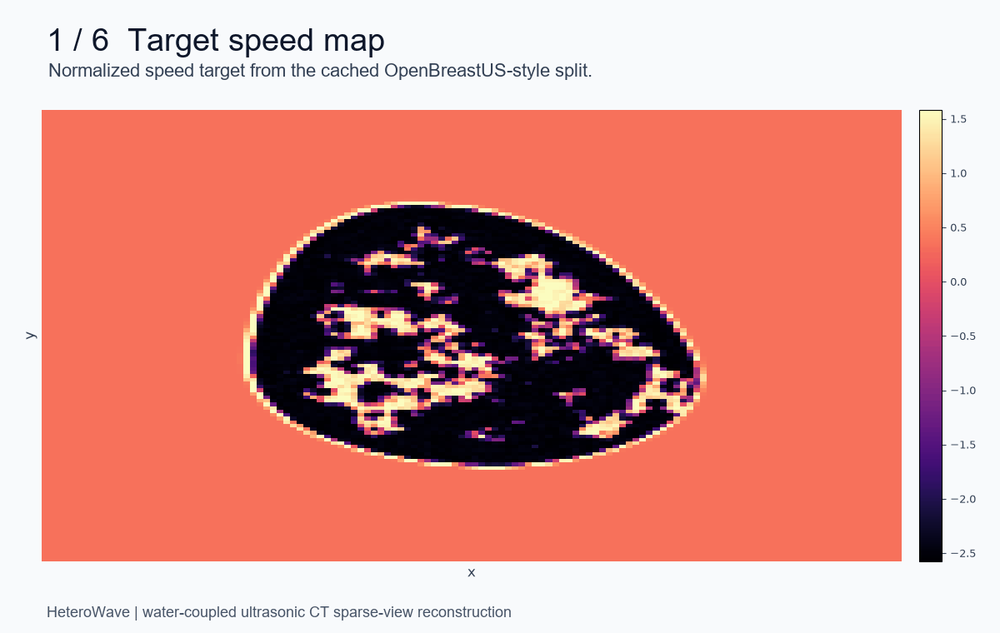
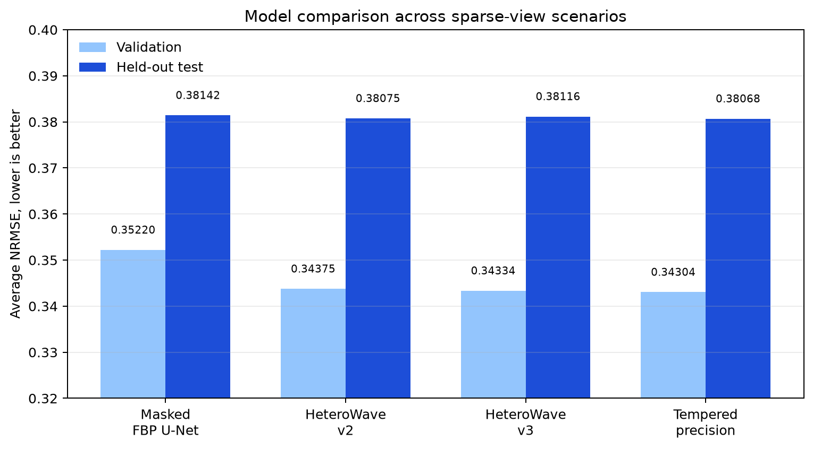
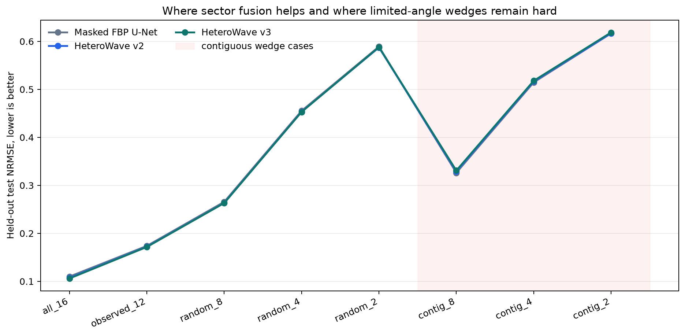

# HeteroWave

Acquisition-aware sparse-view reconstruction for water-coupled ultrasonic CT.

HeteroWave studies how to reconstruct 2D ultrasound CT speed maps when angular
views are incomplete. The current repo uses a controlled straight-ray Radon
proxy built from OpenBreastUS-style speed maps. It is not a full-wave acoustic
solver and it is not clinical validation.

The useful result so far is narrow but real: sector-aware latent fusion improves
or matches a strong mask-aware FBP U-Net baseline on distributed sparse-view
cases, while contiguous limited-angle wedges remain the main unsolved failure
mode.

## Quick Read

| Item | Location |
| --- | --- |
| Curated public artifact folder | https://drive.google.com/drive/folders/1i5QF6GbeHMcSdbbVv-v8ZqANvEVkmfNv |
| Public summary document | https://docs.google.com/document/d/1-J8gkt-wqqP1d7brSKGs8eFXAS43OS9zbZZC6yQCKyU |
| Canonical project handoff | [AGENTS.md](AGENTS.md) |
| Best measured implementation branch | `heterowave-v2` |
| Best average experiment branch | `experiment/tempered-precision-pooling` |
| Current bottleneck | contiguous missing angular wedges |

The Drive folder contains only presentation-safe artifacts: summary prose,
architecture image, workflow GIF, qualitative grids, robustness plots, and CSV
metrics. It excludes raw caches, checkpoints, logs, and model weights.



## Main Discoveries

1. A fair masked FBP U-Net is a strong baseline.

   It receives a masked filtered-backprojection image plus acquisition coverage
   channels. This made the comparison much harder and more honest.

2. HeteroWave v1 was not enough.

   Pure sector aggregation was novel, but it lost to the fair masked U-Net. That
   result changed the direction of the project.

3. HeteroWave v2 is the safest current model.

   V2 keeps the strong masked-FBP U-Net trunk and adds a zero-gated sector
   latent branch. On held-out test, it slightly improves the average NRMSE over
   the fair masked U-Net: `0.38075` vs `0.38142`.

4. HeteroWave v3 helped random sparse-view cases but not wedges.

   Precision-weighted sector reliability and mask-geometry conditioning improved
   validation and random-view test cases, but regressed contiguous wedge cases.

5. Tempered precision pooling is the best average result so far, by a small
   margin.

   Test average NRMSE: `0.38068`, compared with `0.38142` for the masked U-Net.
   This is positive, but it should be described as a small measured gain, not a
   decisive breakthrough.

## Results

Average NRMSE across the fixed sparse-view evaluation suite. Lower is better.



| Model | Validation avg NRMSE | Test avg NRMSE | What changed |
| --- | ---: | ---: | --- |
| Masked FBP U-Net | 0.35220 | 0.38142 | strong fair baseline |
| HeteroWave v2 | 0.34375 | 0.38075 | masked-FBP trunk plus latent sector fusion |
| HeteroWave v3 | 0.34334 | 0.38116 | precision weighting, mask-geometry conditioning |
| Tempered precision pooling | 0.34304 | 0.38068 | tempered reliability pooling |

Held-out test scenario breakdown for the main measured branches:



| Scenario | Masked U-Net | HeteroWave v2 | HeteroWave v3 | Read |
| --- | ---: | ---: | ---: | --- |
| `all_16` | 0.10998 | 0.10735 | 0.10600 | v3 best |
| `observed_12` | 0.17386 | 0.17222 | 0.17163 | v3 best |
| `random_8` | 0.26564 | 0.26344 | 0.26308 | v3 best |
| `random_4` | 0.45532 | 0.45340 | 0.45294 | v3 best |
| `random_2` | 0.58913 | 0.58728 | 0.58809 | v2 best |
| `contiguous_8` | 0.32624 | 0.32893 | 0.33094 | masked U-Net best |
| `contiguous_4` | 0.51462 | 0.51649 | 0.51796 | masked U-Net best |
| `contiguous_2` | 0.61657 | 0.61688 | 0.61860 | masked U-Net best |

The consistent pattern is important: latent sector fusion helps when missing
views are distributed, but it does not solve contiguous limited-angle
extrapolation.

## Architecture

HeteroWave is not just a bigger U-Net. The central idea is acquisition-aware
latent representation fusion.

```text
observed sinogram
    -> sector masks
    -> masked FBP image prior
    -> per-sector backprojections
    -> shared sector encoder
    -> latent sector representations
    -> mask/geometry-aware pooling
    -> fusion with image-space decoder
    -> reconstructed speed map
```

Why this matters:

- The FBP image prior gives the network a physics-informed starting point.
- The mask and coverage channels tell the model what measurements are missing.
- Each observed angular sector becomes a latent representation, so the model can
  reason over a variable set of acquisition evidence rather than treating the
  corrupted image alone as input.
- Zero-gated fusion lets new sector modules start from the known-good masked
  U-Net behavior. If a sector branch helps, training can open the gate; if not,
  the baseline is protected.

Model lineage:

| Stage | Purpose | Outcome |
| --- | --- | --- |
| FBP | physics-only baseline | useful prior, not enough under missing views |
| FBP U-Net | complete-view learned baseline | strong on full 64-angle data |
| Masked FBP U-Net | fair sparse-view baseline | strongest simple baseline |
| HeteroWave v1 | sector-only latent aggregation | lost to masked U-Net |
| Phase 7 v1 | physics consistency, uncertainty | useful infrastructure, not main win |
| HeteroWave v2 | masked U-Net plus zero-gated latent sector fusion | safest positive HeteroWave result |
| HeteroWave v3 | precision weighting and mask geometry | helps random masks, hurts wedges |
| Tempered precision | calibrated reliability pooling | best average result so far |

## Checkpoints And Artifacts

Use `best.pt` for evaluation. Use `last.pt` only to resume the same architecture
and config. Do not use `--resume` across architecture changes; use
`--initialize-from` for partial warm starts.

| Model or result | Drive path |
| --- | --- |
| Complete-view FBP U-Net | `/content/drive/MyDrive/heterowave/results/fbp_unet_baseline` |
| Fair masked FBP U-Net | `/content/drive/MyDrive/heterowave/results/masked_fbp_unet` |
| HeteroWave v2 checkpoint | `/content/drive/MyDrive/heterowave/results/heterowave_v2_fusion` |
| HeteroWave v2 validation artifacts | `/content/drive/MyDrive/heterowave/results/heterowave_v2_validation` |
| HeteroWave v2 test artifacts | `/content/drive/MyDrive/heterowave/results/heterowave_v2_test` |
| HeteroWave v3 checkpoint | `/content/drive/MyDrive/heterowave/results/heterowave_v3_precision` |
| HeteroWave v3 validation artifacts | `/content/drive/MyDrive/heterowave/results/heterowave_v3_validation` |
| HeteroWave v3 test artifacts | `/content/drive/MyDrive/heterowave/results/heterowave_v3_test` |
| Tempered precision checkpoint | `/content/drive/MyDrive/heterowave/results/heterowave_tempered_precision` |
| Tempered precision validation artifacts | `/content/drive/MyDrive/heterowave/results/heterowave_tempered_precision_validation` |
| Tempered precision test artifacts | `/content/drive/MyDrive/heterowave/results/heterowave_tempered_precision_test` |
| FBPConvNet external baseline | `/content/drive/MyDrive/heterowave/results/fbpconvnet_sparse` |
| Learned primal-dual baseline | `/content/drive/MyDrive/heterowave/results/learned_primal_dual` |
| Set-transformer pooling run | `/content/drive/MyDrive/heterowave/results/heterowave_set_transformer_pooling` |

Curated public folder contents:

- `HeteroWave public summary`
- `01_architecture_heterowave_v2.png`
- `02_qualitative_grid_v2_validation.png`
- `03_random_sparse_view_robustness_v2_validation.png`
- `04_contiguous_wedge_robustness_v2_validation.png`
- `05_metrics_by_scenario_v2_validation.csv`
- `06_metrics_by_scenario_v2_test.csv`
- `07_metrics_by_scenario_tempered_precision_test.csv`
- `08_qualitative_grid_tempered_precision_test.png`
- `09_workflow_overview.gif`

Important: the Drive connector could not set true public sharing. Before sending
the folder externally, manually set:

```text
Share -> General access -> Anyone with the link -> Viewer
```

## Medical And Physics Context

The target modality is water-coupled ultrasonic CT. Water is the coupling
medium; it is not "water noise." The medically relevant reconstruction target
here is a sound-speed map, which can encode tissue-dependent acoustic
properties.

This repo currently uses a straight-ray approximation:

```text
speed map -> slowness contrast -> parallel-beam projection -> sinogram
```

That makes the project a controlled sparse-view reconstruction benchmark. It is
useful for studying missing-angle robustness, but it does not claim to match
full-wave ultrasound tomography or clinical scanner behavior.

Relevant future stressors for real water-coupled ultrasonic CT:

- transducer dropout;
- timing or phase drift;
- gain and calibration variation;
- ring geometry perturbation;
- scan motion;
- refraction, attenuation, and scattering;
- mismatch between straight-ray simulation and wave propagation.

## Why The Research Direction Is Pertinent

The work is aligned with three evidence-backed ideas from inverse imaging:

1. Physics priors matter.

   FBP gives a meaningful first reconstruction. Learned models should refine
   this, not ignore it.

2. Measurements should be preserved.

   Future sinogram-completion branches should never overwrite observed data:

   ```python
   completed = observed_mask * observed_sinogram + missing_mask * predicted_missing
   ```

3. Acquisition geometry should be part of the model.

   Sparse-view failure is not only an image problem. It is a measurement-geometry
   problem. HeteroWave's latent sector representations are an early step toward
   acquisition-invariant reconstruction: the model reasons over what was
   actually measured.

## Current Best Next Step

Build an observed-preserving dual-domain branch:

```text
observed sinogram
    -> predict missing sinogram only
    -> preserve observed measurements exactly
    -> FBP/backproject completed-missing sinogram
    -> fuse with masked-FBP trunk and sector latents
```

Success criteria:

- improve `contiguous_8` and `contiguous_4`;
- do not materially regress `all_16`, `observed_12`, or random sparse-view
  cases;
- run held-out test only after validation wedge performance improves.

This is the highest-probability path because the main remaining weakness is not
generic image denoising. It is missing contiguous angular information.

## Branch Map

| Branch | Purpose |
| --- | --- |
| `main` | public-facing README and early code |
| `heterowave-v2` | masked-FBP trunk plus sector-wise latent fusion |
| `heterowave-v3` | precision weighting, mask geometry conditioning, acquisition hooks |
| `experiment/tempered-precision-pooling` | tempered reliability pooling; best average result so far |
| `experiment/set-transformer-sector-pooling` | set-transformer sector aggregation |
| `experiment/gated-sector-pooling` | gated/MIL-style sector pooling |
| `experiment/fbpconvnet-baseline` | external FBPConvNet-style baseline |
| `experiment/learned-primal-dual-baseline` | compact learned primal-dual baseline |
| `phase7-v1` | physics consistency and uncertainty experiments |

## Local Setup

Use Python 3.11.

```powershell
conda create -n heterowave python=3.11 git -y
conda activate heterowave
python -m pip install --upgrade pip setuptools wheel
python -m pip install torch==2.7.1 torchvision==0.22.1 --index-url https://download.pytorch.org/whl/cu126
python -m pip install -e ".[dev]"
pytest -q
```

Preprocess data with explicit paths:

```bash
python scripts/prepare_cache.py \
  --train-mat /path/to/breast_train_speed.mat \
  --test-mat /path/to/breast_test_speed.mat \
  --output-dir /path/to/cache_128 \
  --image-size 128 \
  --num-angles 64 \
  --batch-size 32 \
  --device cuda
```

The local persistent cache copy is expected at:

```text
A:\projects\heterowave\cache_128
```

Colab commonly uses:

```text
/content/heterowave_data/cache_128
```

## Evaluation Protocol

The fixed seed-1337 suite includes:

| Scenario | Observed sectors | Pattern |
| --- | ---: | --- |
| `all_16` | 16 | full acquisition |
| `observed_12` | 12 | random observed sectors |
| `random_8` | 8 | random observed sectors |
| `random_4` | 4 | random observed sectors |
| `random_2` | 2 | random observed sectors |
| `contiguous_8` | 8 | contiguous angular wedge |
| `contiguous_4` | 4 | contiguous angular wedge |
| `contiguous_2` | 2 | contiguous angular wedge |

Evaluation artifacts include:

- `metrics_by_scenario.csv`;
- `robustness_random.png`;
- `robustness_wedge.png`;
- `qualitative_grid.png`;
- `architecture.png`;
- checkpoint provenance and config files.

Use validation to choose a model. Use held-out test only after the validation
decision is frozen.

## Language To Use

Use:

- water-coupled ultrasonic CT;
- sparse-view and limited-angle reconstruction;
- physics-informed FBP prior;
- acquisition-aware latent representation fusion;
- observed-measurement preservation;
- missing-sector robustness.

Avoid:

- clinical validation;
- X-ray CT;
- full-wave ultrasound inversion claims;
- "water noise";
- global SOTA claims without matched data, forward model, and metric protocol.
